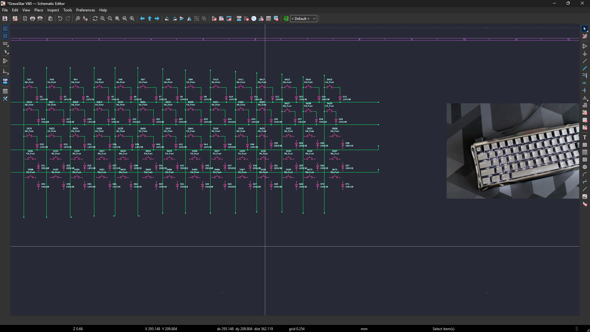
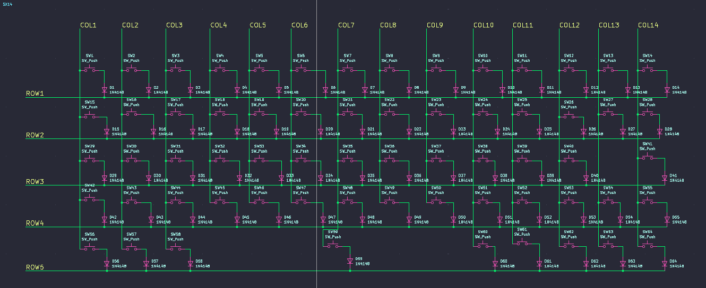

# August 31 2026: Designed the PCB Schematics
So today i officially started my project (i hope i finish it before the deadline💀💀)…so i started with the pcb schematics ….i didnt finish it today so ill try to do that tommorow (or some time….[im very busy]
(theres a duplicate...i cant find a way to delete the first)

**Total time spent: ~44m**

# September 2nd, 2026: Finished the PCB schematics
i finish the schematics of the keyboard today...connected all the rows and columns... so its remaining the pcb then the case

**Total time spent: 40m**
