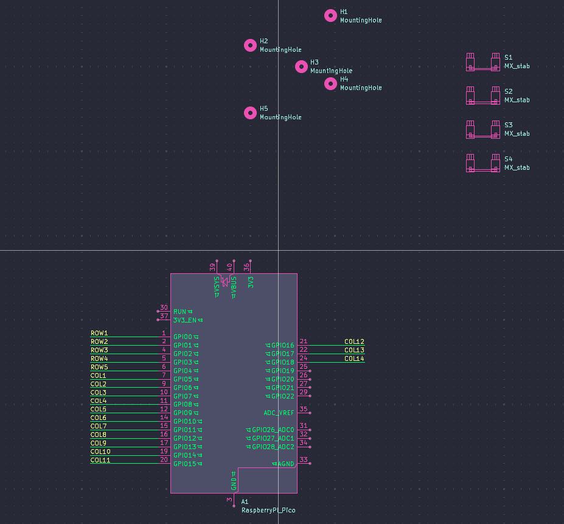
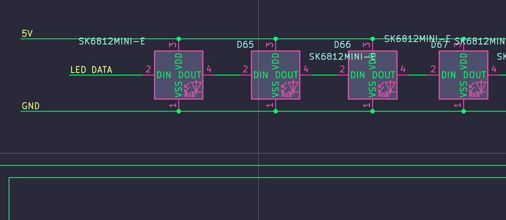
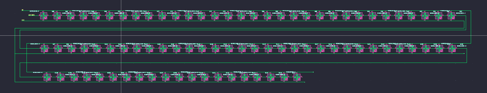
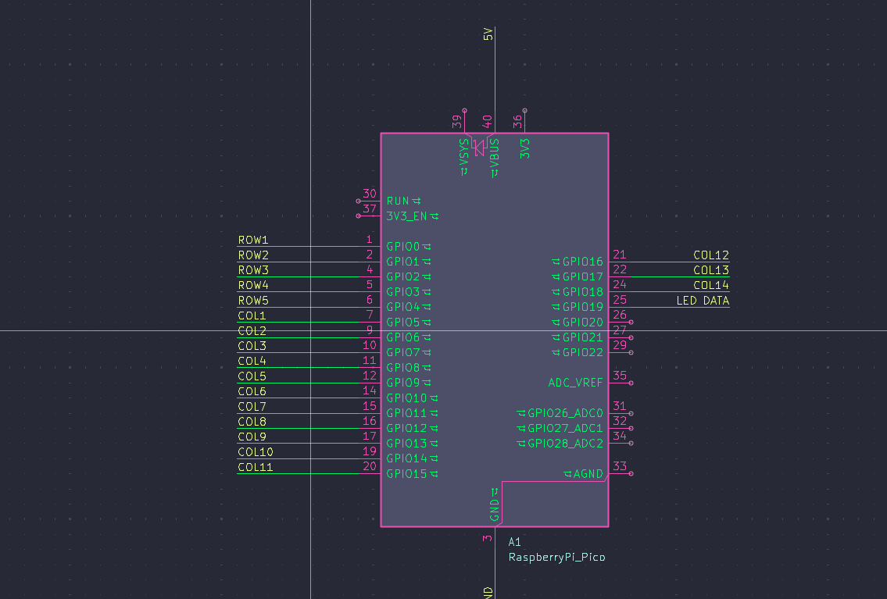
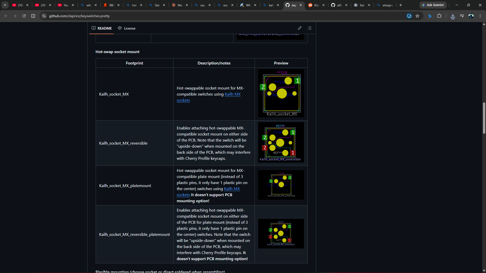
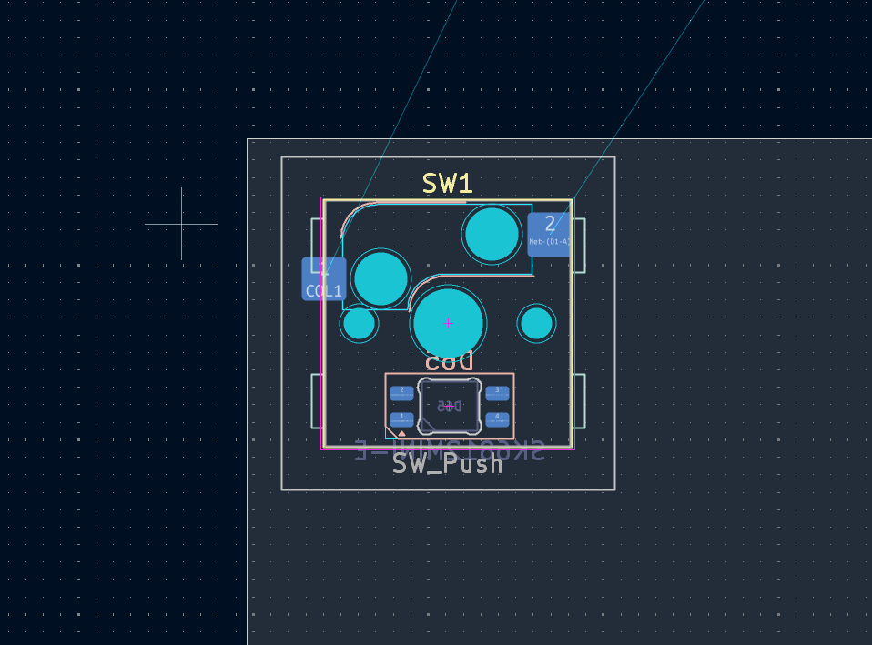

# August 31 2026: Designed the PCB Schematics
So today i officially started my project (i hope i finish it before the deadline💀💀)…so i started with the pcb schematics ….i didnt finish it today so ill try to do that tommorow (or some time….[im very busy]
(theres a duplicate...i cant find a way to delete the first)

**Total time spent: ~44m**

# September 2nd, 2026: Finished the PCB schematics
i finish the schematics of the keyboard today...connected all the rows and columns... so its remaining the pcb then the case

**Total time spent: 40m**

# September 3rd, 2026: Added SK6812 Mini-E leds and assigned footprints
wow...i completely forgot im supposed to add leds to the pcb...wow they are a lot and all to be hand soldered...so i did a long hard research onn the sk6812 led datasheets and the rest and found out that the ki cad version was mirrored the other way....so i mirrored it back. Also while assiging footprint i had to search for the big keys size for the stabilizers (Tab, caps, space and the rest)...it said that tab key was 1.5u but i thought it was 2u so i just cotinued like that and yh the spacebar remained the same at 6.25u...so now for the second time....unto the pcb

**Total time spent: ~43m**

# September 2nd, 2026: Decided to Make it Hot Swappable
i literally just found out today that its possible to hot swap the actual switches themselves....i wanted to add it to my keyboard so i tried doing some research on it (suprised it took this long)...and most of what i was seeing wasn't helpful....so i had to do it 😔😔...i used AI to help me explain the whole hotswappable switchs and also south facing switches and led placements  and so i went with the kailh mx hot swap circuits...i found the foot prints from another github repo (https://github.com/daprice/keyswitches.pretty)...

