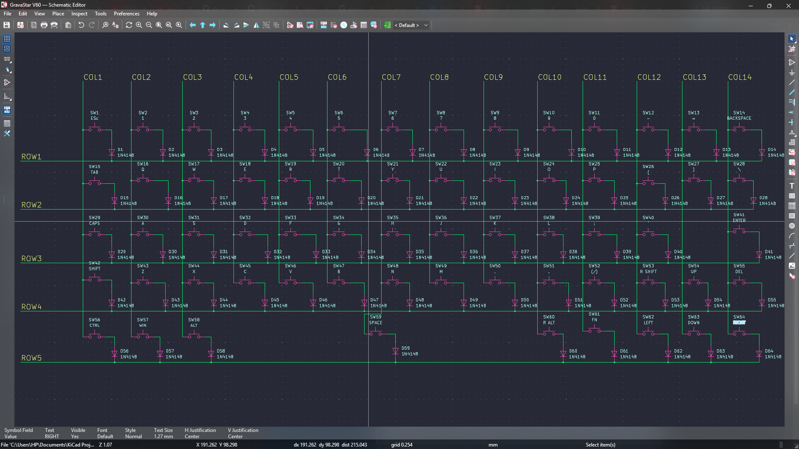
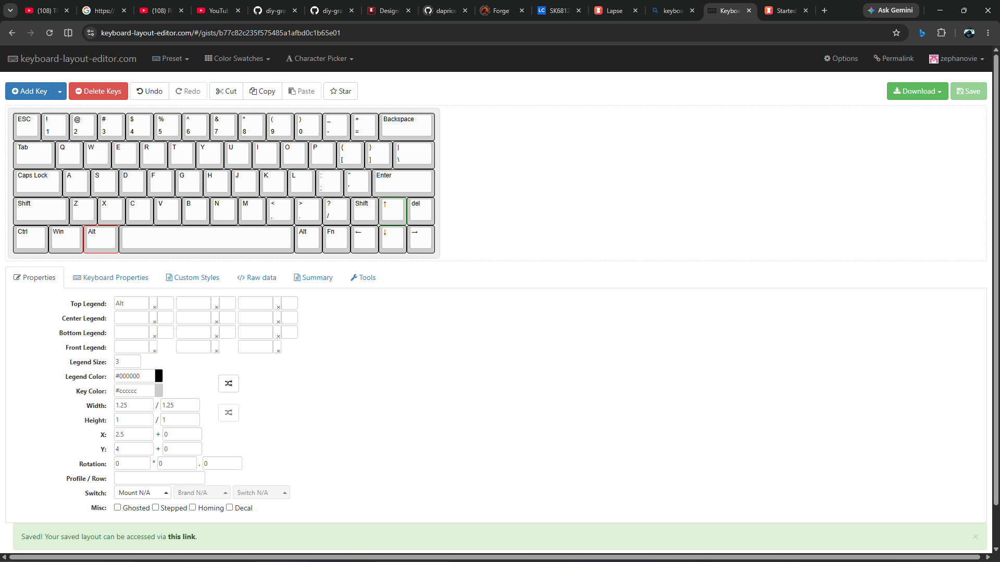

# August 31 2026: Designed the PCB Schematics
So today i officially started my project (i hope i finish it before the deadline💀💀)…so i started with the pcb schematics ….i didnt finish it today so ill try to do that tommorow (or some time….[im very busy]
(theres a duplicate...i cant find a way to delete the first)

**Total time spent: ~44m**

# September 2nd, 2026: Finished the PCB schematics
i finish the schematics of the keyboard today...connected all the rows and columns... so its remaining the pcb then the case

**Total time spent: 40m**

# September 3rd, 2026: Added SK6812 Mini-E leds and assigned footprints
wow...i completely forgot im supposed to add leds to the pcb...wow they are a lot and all to be hand soldered...so i did a long hard research onn the sk6812 led datasheets and the rest and found out that the ki cad version was mirrored the other way....so i mirrored it back. Also while assiging footprint i had to search for the big keys size for the stabilizers (Tab, caps, space and the rest)...it said that tab key was 1.5u but i thought it was 2u so i just cotinued like that and yh the spacebar remained the same at 6.25u...so now for the second time....unto the pcb

**Total time spent: ~43m**

# September 2nd, 2026: Decided to Make it Hot Swappable
i literally just found out today that its possible to hot swap the actual switches themselves....i wanted to add it to my keyboard so i tried doing some research on it (suprised it took this long)...and most of what i was seeing wasn't helpful....so i had to do it 😔😔...i used AI to help me explain the whole hotswappable switchs and also south facing switches and led placements  and so i went with the kailh mx hot swap circuits...i found the foot prints from another github repo (https://github.com/daprice/keyswitches.pretty)...

**Total time spent: ~1h**

# September 2nd, 2026: Finally started the PCB
so i started the pcb design today and boy oh boy i had ALOT of issues...i had to reassign the footprints first was for all the switches to the kailh hot swappable socket...then also resized the big keys(shift, caps and tabs keys). i made a mistake mirroring the sk6812 mini-e led.....yes the kicad one was correct as the led would be mounted on the back of the PCB...so when you flip it (putting it on the bottom of the pcb the pads align)...that was just for the footprints....the main issue that i had her was that the switch footprint just never aligned with each other.....i tried all i colud from changing grid size to changing grid origin and it still wound't align sooo to fix this i decided to use KLE(Keyboard layout editor)...and import it from there....so i had to make the exact layout in KLE...and lowk this help me find another problem....the first 3 bottom row keys weren't 1u but 1.25u and also one random key (\|) was also different at 1.5u....in sure this problem would have had me stressing in the future when doing the pcb...so i guess i dodged a bullet....and to reduce errors and to make it easier later i had to rename the schematics to their respective keys i have'nt changed those keys yet or lay out the pcb ...that would be in the next log(hopefully)

**Total time spent: ~1h 15m**
